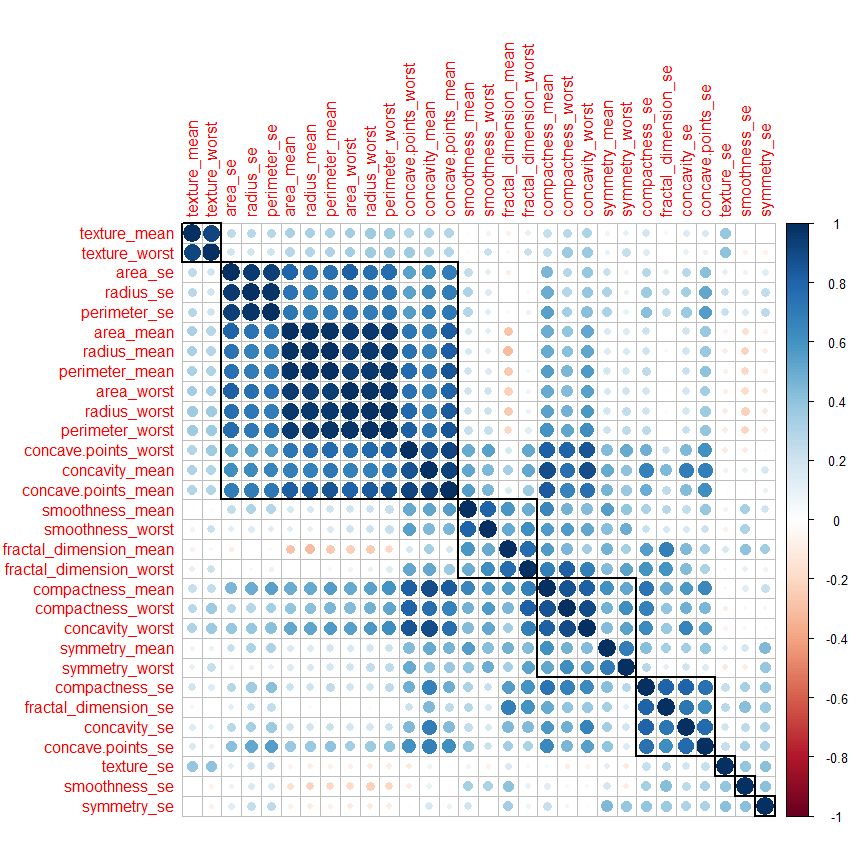
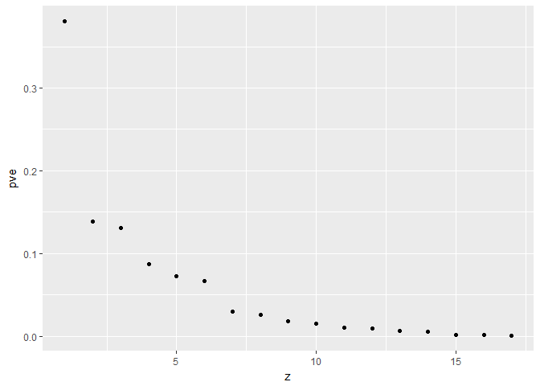
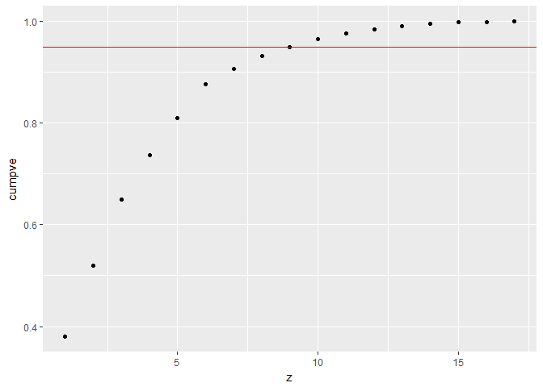
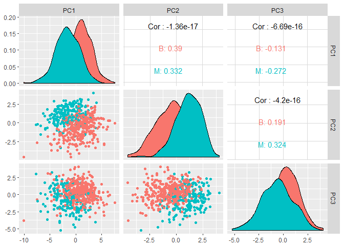

Introduction
------------

The procedure adopted here follows the suggestions from Applied predictive modeling and Introduction to Statistical Learning books.

Let us first import the data
----------------------------

``` r
bcData <- read.csv("bc.data.csv", header = T)
head(bcData)
```

    ##         id diagnosis radius_mean texture_mean perimeter_mean area_mean
    ## 1   842302         M       17.99        10.38         122.80    1001.0
    ## 2   842517         M       20.57        17.77         132.90    1326.0
    ## 3 84300903         M       19.69        21.25         130.00    1203.0
    ## 4 84348301         M       11.42        20.38          77.58     386.1
    ## 5 84358402         M       20.29        14.34         135.10    1297.0
    ## 6   843786         M       12.45        15.70          82.57     477.1
    ##   smoothness_mean compactness_mean concavity_mean concave.points_mean
    ## 1         0.11840          0.27760         0.3001             0.14710
    ## 2         0.08474          0.07864         0.0869             0.07017
    ## 3         0.10960          0.15990         0.1974             0.12790
    ## 4         0.14250          0.28390         0.2414             0.10520
    ## 5         0.10030          0.13280         0.1980             0.10430
    ## 6         0.12780          0.17000         0.1578             0.08089
    ##   symmetry_mean fractal_dimension_mean radius_se texture_se perimeter_se
    ## 1        0.2419                0.07871    1.0950     0.9053        8.589
    ## 2        0.1812                0.05667    0.5435     0.7339        3.398
    ## 3        0.2069                0.05999    0.7456     0.7869        4.585
    ## 4        0.2597                0.09744    0.4956     1.1560        3.445
    ## 5        0.1809                0.05883    0.7572     0.7813        5.438
    ## 6        0.2087                0.07613    0.3345     0.8902        2.217
    ##   area_se smoothness_se compactness_se concavity_se concave.points_se
    ## 1  153.40      0.006399        0.04904      0.05373           0.01587
    ## 2   74.08      0.005225        0.01308      0.01860           0.01340
    ## 3   94.03      0.006150        0.04006      0.03832           0.02058
    ## 4   27.23      0.009110        0.07458      0.05661           0.01867
    ## 5   94.44      0.011490        0.02461      0.05688           0.01885
    ## 6   27.19      0.007510        0.03345      0.03672           0.01137
    ##   symmetry_se fractal_dimension_se radius_worst texture_worst
    ## 1     0.03003             0.006193        25.38         17.33
    ## 2     0.01389             0.003532        24.99         23.41
    ## 3     0.02250             0.004571        23.57         25.53
    ## 4     0.05963             0.009208        14.91         26.50
    ## 5     0.01756             0.005115        22.54         16.67
    ## 6     0.02165             0.005082        15.47         23.75
    ##   perimeter_worst area_worst smoothness_worst compactness_worst
    ## 1          184.60     2019.0           0.1622            0.6656
    ## 2          158.80     1956.0           0.1238            0.1866
    ## 3          152.50     1709.0           0.1444            0.4245
    ## 4           98.87      567.7           0.2098            0.8663
    ## 5          152.20     1575.0           0.1374            0.2050
    ## 6          103.40      741.6           0.1791            0.5249
    ##   concavity_worst concave.points_worst symmetry_worst
    ## 1          0.7119               0.2654         0.4601
    ## 2          0.2416               0.1860         0.2750
    ## 3          0.4504               0.2430         0.3613
    ## 4          0.6869               0.2575         0.6638
    ## 5          0.4000               0.1625         0.2364
    ## 6          0.5355               0.1741         0.3985
    ##   fractal_dimension_worst  X
    ## 1                 0.11890 NA
    ## 2                 0.08902 NA
    ## 3                 0.08758 NA
    ## 4                 0.17300 NA
    ## 5                 0.07678 NA
    ## 6                 0.12440 NA

``` r
#Remove the last column
bcData <- bcData[,-33]
#Get the response variable
segmentation <- bcData[,2]
head(bcData)
```

    ##         id diagnosis radius_mean texture_mean perimeter_mean area_mean
    ## 1   842302         M       17.99        10.38         122.80    1001.0
    ## 2   842517         M       20.57        17.77         132.90    1326.0
    ## 3 84300903         M       19.69        21.25         130.00    1203.0
    ## 4 84348301         M       11.42        20.38          77.58     386.1
    ## 5 84358402         M       20.29        14.34         135.10    1297.0
    ## 6   843786         M       12.45        15.70          82.57     477.1
    ##   smoothness_mean compactness_mean concavity_mean concave.points_mean
    ## 1         0.11840          0.27760         0.3001             0.14710
    ## 2         0.08474          0.07864         0.0869             0.07017
    ## 3         0.10960          0.15990         0.1974             0.12790
    ## 4         0.14250          0.28390         0.2414             0.10520
    ## 5         0.10030          0.13280         0.1980             0.10430
    ## 6         0.12780          0.17000         0.1578             0.08089
    ##   symmetry_mean fractal_dimension_mean radius_se texture_se perimeter_se
    ## 1        0.2419                0.07871    1.0950     0.9053        8.589
    ## 2        0.1812                0.05667    0.5435     0.7339        3.398
    ## 3        0.2069                0.05999    0.7456     0.7869        4.585
    ## 4        0.2597                0.09744    0.4956     1.1560        3.445
    ## 5        0.1809                0.05883    0.7572     0.7813        5.438
    ## 6        0.2087                0.07613    0.3345     0.8902        2.217
    ##   area_se smoothness_se compactness_se concavity_se concave.points_se
    ## 1  153.40      0.006399        0.04904      0.05373           0.01587
    ## 2   74.08      0.005225        0.01308      0.01860           0.01340
    ## 3   94.03      0.006150        0.04006      0.03832           0.02058
    ## 4   27.23      0.009110        0.07458      0.05661           0.01867
    ## 5   94.44      0.011490        0.02461      0.05688           0.01885
    ## 6   27.19      0.007510        0.03345      0.03672           0.01137
    ##   symmetry_se fractal_dimension_se radius_worst texture_worst
    ## 1     0.03003             0.006193        25.38         17.33
    ## 2     0.01389             0.003532        24.99         23.41
    ## 3     0.02250             0.004571        23.57         25.53
    ## 4     0.05963             0.009208        14.91         26.50
    ## 5     0.01756             0.005115        22.54         16.67
    ## 6     0.02165             0.005082        15.47         23.75
    ##   perimeter_worst area_worst smoothness_worst compactness_worst
    ## 1          184.60     2019.0           0.1622            0.6656
    ## 2          158.80     1956.0           0.1238            0.1866
    ## 3          152.50     1709.0           0.1444            0.4245
    ## 4           98.87      567.7           0.2098            0.8663
    ## 5          152.20     1575.0           0.1374            0.2050
    ## 6          103.40      741.6           0.1791            0.5249
    ##   concavity_worst concave.points_worst symmetry_worst
    ## 1          0.7119               0.2654         0.4601
    ## 2          0.2416               0.1860         0.2750
    ## 3          0.4504               0.2430         0.3613
    ## 4          0.6869               0.2575         0.6638
    ## 5          0.4000               0.1625         0.2364
    ## 6          0.5355               0.1741         0.3985
    ##   fractal_dimension_worst
    ## 1                 0.11890
    ## 2                 0.08902
    ## 3                 0.08758
    ## 4                 0.17300
    ## 5                 0.07678
    ## 6                 0.12440

``` r
#Remove the first two columns
bcData <- bcData[,-c(1:2)]
```

Filtering the data
------------------

Looking at the data the first thing we notice is that it contains a number of correlated predictors such as radius, area, perimeter and shape as a linear or some form of combination of each other. In this kind of situations it will make our analysis more robust and easy to identify and remove highly correlated predicators.

Let's start first handle collinearity and remove some predictors

``` r
# calculate collinearity
correlations <- cor(bcData)
dim(correlations)
```

    ## [1] 30 30

``` r
library(corrplot)
corrplot(correlations, order = "hclust", tl.cex=1, addrect = 8)
```



Let use the findcorrelation() function from caret package to remove highly correlated predictors

``` r
# remove predictors based on whose correlation is above 0.85. This function uses
# a heuristic algorithm to determine which variable should be removed instead selecting blindly
highCorr <- findCorrelation(correlations, cutoff = .85)
length(highCorr)
```

    ## [1] 13

``` r
#we have 13 highly correlated predictors to be removed
filteredBcData <- bcData[, -highCorr]
```

Data transformation
-------------------

It might be beneficial to transform our data by scaling and centering. This will be necessary especially for some machine learning algorithms that best perform on centered and scaled data.

In addition to that we can transform the data for skewed predictors in our data.

The caret package has nice packaged to help us transform our data as desired. Here we will use preProcess and predict function to transform the data and conduct PCA on the transformed data.

``` r
# define the transformation or pre-processing 
bc.trans <- preProcess(filteredBcData, method = c("BoxCox", "center", "scale"))
#apply the trasnformation
bc.transformed <- predict(bc.trans, filteredBcData)
head(bc.transformed[,1:4])
```

    ##    area_mean smoothness_mean symmetry_mean fractal_dimension_mean
    ## 1  1.1292186       1.4874017    1.96265106              1.9340037
    ## 2  1.7111779      -0.8103020    0.09828705             -0.9448696
    ## 3  1.5096864       0.9568640    0.97423453             -0.3015621
    ## 4 -0.8425905       2.7601291    2.39661000              3.0107385
    ## 5  1.6654085       0.3477375    0.08712188             -0.5139916
    ## 6 -0.4045600       2.0122134    1.03023853              1.7204268

PCA and Proportion of variance explaind (PVE)
---------------------------------------------

Here we conduct PCA on the transformed data and calculate the PVE using r base functions.

``` r
# Using 
pca.out <- prcomp(bc.transformed)
#calculate the standard deviation
pca.var = pca.out$sdev^2

#Calculate proportion of variance explained
pve = pca.var/sum(pca.var)
z = seq(1,17)

#Calculate cummulative PVE
cumpve = cumsum(pve)
pve.table = as.data.frame(cbind(z,pve, cumpve))
ggplot(pve.table, aes(x=z,y=pve))+geom_point()
```



``` r
ggplot(pve.table, aes(x=z,y=cumpve))+geom_point()+geom_abline(intercept=0.95, slope = 0, color="red")
```



Let's us plot the scatter plot matrix for the first 3 PCs.

``` r
require(GGally)
```

    ## Loading required package: GGally

``` r
PCs <- as.data.frame(cbind(segmentation,pca.out$x))
PCs$segmentation <- segmentation
ggpairs(data=PCs,columns = 2:4, ggplot2::aes(color=segmentation))
```




As it can be seen from the above plots the first 3 principal components separate the two classes some extent only, this is expected since the variance explained by these components is not large. Using the first few principal components might be enough for classification purpose. In the next section we will try to develop some classification models and compare them.
