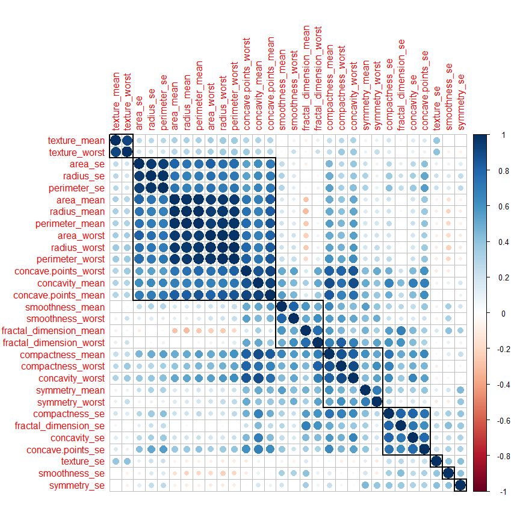
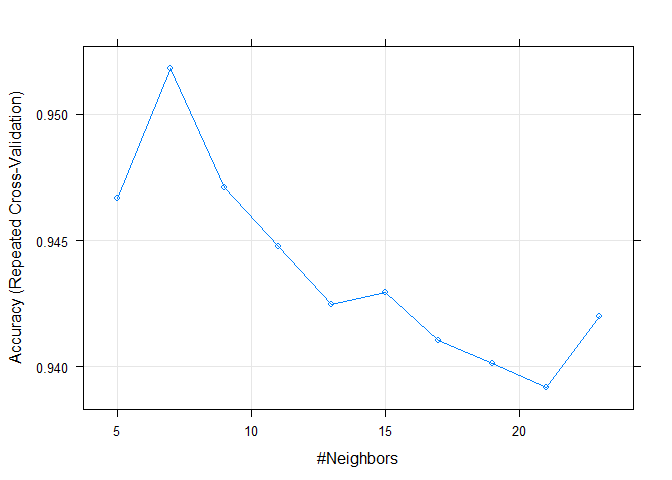
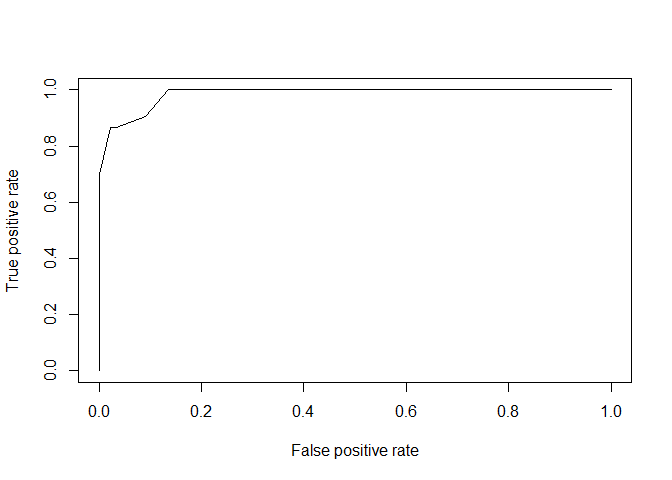
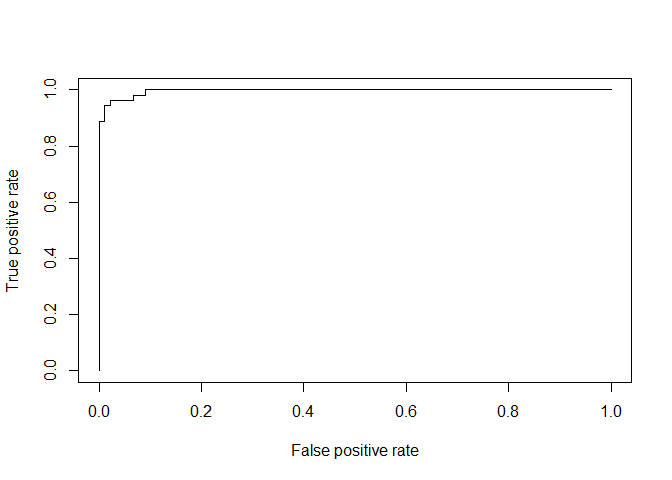
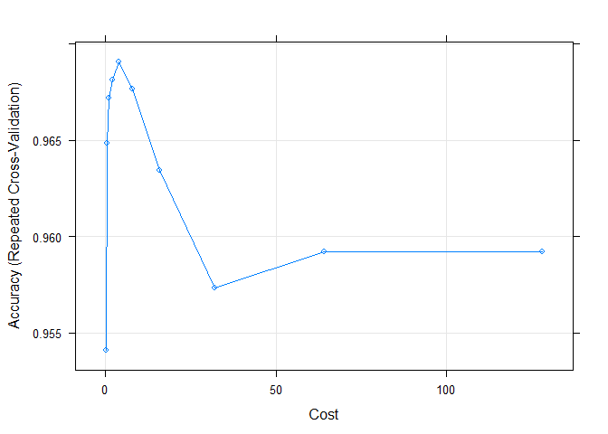
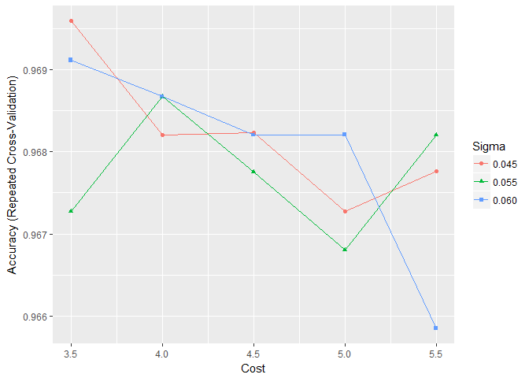
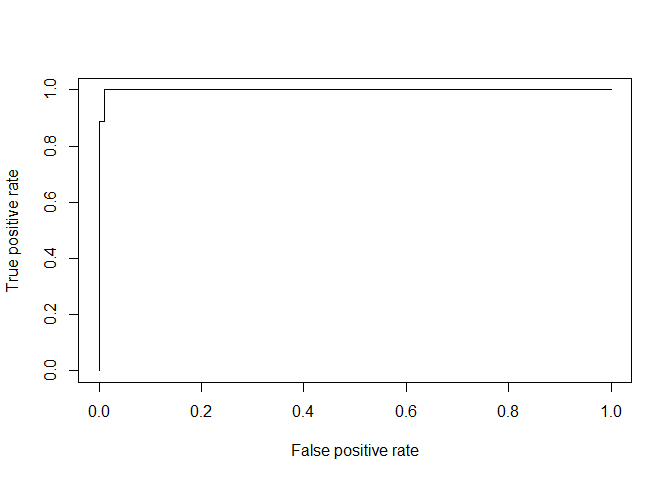

Introduction
------------

In this blog we will see how we can build and compare simple machine learning techniques in R for the breast cancer data from [Wisconsin dataset](https://www.kaggle.com/uciml/breast-cancer-wisconsin-data). I have already showed how we can do explanotary data analysis in my [previous post](https://zerualem.github.io/zerualem.github.io/machine-learning/2017/04/27/bc-data-analysis.html). Here some parts are repeated because they are need for the modeling task.

<!--more-->

The procedure adopted here follows the suggestions from Applied predictive modeling and Introduction to Statistical Learning books.

Let us first import the data
----------------------------

``` r
bcData <- read.csv("bc.data.csv", header = T)
#Remove the last column
bcData <- bcData[,-33]
#Get the response variable

diagnosis <- bcData[,2]
#Remove the first two columns
bcData <- bcData[,-c(1:2)]
```

Filtering the data
------------------

Looking at the data the first thing we notice is that it contains a number of correlated predictors such as radius, area, perimeter and shape as a linear or some form of combination of each other. In this kind of situations it will make our analysis more robust and easy to identify and remove highly correlated predicators.

Let's start first handle collinearity and remove some predictors

``` r
# calculate collinearity
correlations <- cor(bcData)
dim(correlations)
```

    ## [1] 30 30

``` r
library(corrplot)
corrplot(correlations, order = "hclust", tl.cex=1, addrect = 8)
```




Let use the findcorrelation() function from caret package to remove highly correlated predictors

``` r
# remove predictors based on whose correlation is above 0.85. This function uses
# a heuristic algorithm to determine which variable should be removed instead selecting blindly
highCorr <- findCorrelation(correlations, cutoff = .85)
length(highCorr)
```

    ## [1] 13

``` r
#we have 13 highly correlated predictors to be removed
filteredBcData <- bcData[, -highCorr]
```

Data transformation
-------------------

It might be beneficial to transform our data by scaling and centering. This will be necessary especially for some machine learning algorithms that best perform on centered and scaled data.

In addition to that we can transform the data for skewed predictors in our data.

The caret package has nice packaged to help us transform our data as desired. Here we will use preProcess and predict function to transform the data. I have already done this and also PCA on the transformed data in my [previous post](https://zerualem.github.io/zerualem.github.io/machine-learning/2017/04/27/bc-data-analysis.html).

``` r
# define the transformation or pre-processing 
bc.trans <- preProcess(filteredBcData, method = c("BoxCox", "center", "scale"))
#apply the trasnformation
bc.transformed <- predict(bc.trans, filteredBcData)
#head(bc.transformed[,1:4])
```
    ##    area_mean smoothness_mean symmetry_mean fractal_dimension_mean
    ## 1  1.1292186       1.4874017    1.96265106              1.9340037
    ## 2  1.7111779      -0.8103020    0.09828705             -0.9448696
    ## 3  1.5096864       0.9568640    0.97423453             -0.3015621
    ## 4 -0.8425905       2.7601291    2.39661000              3.0107385
    ## 5  1.6654085       0.3477375    0.08712188             -0.5139916
    ## 6 -0.4045600       2.0122134    1.03023853              1.7204268

Modeling
--------

There are different types of supervised modeling approaches (algorithms) that we can try on this dataset. For example, KNN, logistic and SVM will be shown here.

In addition, we will be using the data we transformed above instead of the raw data. Later on we can also try to model using the principal components.

Data spliting train/test sets
-----------------------------

``` r
library(caret)
set.seed(1)

indxTrain <- createDataPartition(y =diagnosis,p = 0.75,list = FALSE)
training <- bc.transformed[indxTrain,]
testing <- bc.transformed[-indxTrain,]
```

Modeling
========

Classification using KNN
------------------------

``` r
set.seed(400)

ctrl <- trainControl(method="repeatedcv",repeats = 5) 
knnFit <- train(y= diagnosis[indxTrain] , 
                x = training, method = "knn", 
                trControl = ctrl, 
                tuneLength = 10)

plot(knnFit)
```




``` r
knnFit
```

    ## k-Nearest Neighbors 
    ## 
    ## 427 samples
    ##  17 predictor
    ##   2 classes: 'B', 'M' 
    ## 
    ## No pre-processing
    ## Resampling: Cross-Validated (10 fold, repeated 5 times) 
    ## Summary of sample sizes: 384, 384, 384, 385, 385, 384, ... 
    ## Resampling results across tuning parameters:
    ## 
    ##   k   Accuracy   Kappa    
    ##    5  0.9466656  0.8847489
    ##    7  0.9518046  0.8955297
    ##    9  0.9471091  0.8846525
    ##   11  0.9447724  0.8797456
    ##   13  0.9424469  0.8745223
    ##   15  0.9429341  0.8754893
    ##   17  0.9410404  0.8712046
    ##   19  0.9401102  0.8692322
    ##   21  0.9391910  0.8672316
    ##   23  0.9419817  0.8733047
    ## 
    ## Accuracy was used to select the optimal model using  the largest value.
    ## The final value used for the model was k = 7.

As it can be seen from the above result the best performance is when k=7 resulting in accuracy of 95.2%.

Let see the performance of the model on the test data.

``` r
knnPredict <- predict(knnFit,newdata = testing )
#Get the confusion matrix to see accuracy value and other parameter values
confusionMatrix(knnPredict, diagnosis[-indxTrain] )
```

    ## Confusion Matrix and Statistics
    ## 
    ##           Reference
    ## Prediction  B  M
    ##          B 86  7
    ##          M  3 46
    ##                                           
    ##                Accuracy : 0.9296          
    ##                  95% CI : (0.8743, 0.9657)
    ##     No Information Rate : 0.6268          
    ##     P-Value [Acc > NIR] : <2e-16          
    ##                                           
    ##                   Kappa : 0.8471          
    ##  Mcnemar's Test P-Value : 0.3428          
    ##                                           
    ##             Sensitivity : 0.9663          
    ##             Specificity : 0.8679          
    ##          Pos Pred Value : 0.9247          
    ##          Neg Pred Value : 0.9388          
    ##              Prevalence : 0.6268          
    ##          Detection Rate : 0.6056          
    ##    Detection Prevalence : 0.6549          
    ##       Balanced Accuracy : 0.9171          
    ##                                           
    ##        'Positive' Class : B               
    ## 


``` r
#Plot the ROC curve
knn.probs <- predict(knnFit, testing, type="prob")
test.diagnosis <- as.character(diagnosis[-indxTrain])

library(ROCR)
```

    ## Loading required package: gplots

    ## 
    ## Attaching package: 'gplots'

    ## The following object is masked from 'package:stats':
    ## 
    ##     lowess

``` r
predob <- prediction(knn.probs[["M"]],test.diagnosis)
perf <- performance(predob, "tpr", "fpr")
plot(perf, color="red")
```




``` r
#The area under the curve
unlist(performance(predob,"auc")@y.values[1])
```

    ## [1] 0.9851601

As the results show about the KNN model has a good preformance on the test data also.

Logistic regression
-------------------

``` r
#Check how the dummy argument is coded in R
contrasts(diagnosis)
```

    ##   M
    ## B 0
    ## M 1

``` r
set.seed(400)
logFit <- train(y= diagnosis[indxTrain] , 
                x = training, method = "glm", 
                trControl = ctrl, 
                family="binomial")

logFit$results
```

    ##   parameter  Accuracy     Kappa AccuracySD    KappaSD
    ## 1      none 0.9545172 0.9028113 0.03152696 0.06717511

``` r
#summary(logFit)
#exp(coef(log.fit$finalModel))
```

**Predict the probabilities for the test data**

Let's see how we can calculate the prediction accuracy for a specified cut of probability of success.

``` r
log.probs <- predict(logFit, testing, type = "prob")

# If we want to calculate the prediction accuracy for a specified cut of probability we can do the following
log.preds <- rep("B", nrow(testing))
hh <- log.probs[,2] > 0.5

log.preds[hh] <- "M" 

test.diagnosis <- as.character(diagnosis[-indxTrain])

table(log.preds, test.diagnosis)
```

    ##          test.diagnosis
    ## log.preds  B  M
    ##         B 84  2
    ##         M  5 51

``` r
mean(log.preds==test.diagnosis)
```

    ## [1] 0.9507042

**ROC curve for logistic regression**

``` r
#Plot the ROC curve
log.probs <- predict(logFit, testing, type="prob")
#test.diagnosis <- as.character(diagnosis[-indxTrain])

#library(ROCR)
predob <- prediction(log.probs[["M"]],test.diagnosis)
perf <- performance(predob, "tpr", "fpr")
plot(perf, color="red")
```




``` r
#The area under the curve
unlist(performance(predob,"auc")@y.values[1])
```

    ## [1] 0.995972

Using SVM
---------

Now we will try classification using SVM. We will be using the e1071 package.

``` r
set.seed(400)
svmFit <- train(y= diagnosis[indxTrain] , 
                x = training, method = "svmRadial", 
                trControl = ctrl, 
                tuneLength = 10)
```

    ## Loading required package: kernlab

    ## 
    ## Attaching package: 'kernlab'

    ## The following object is masked from 'package:ggplot2':
    ## 
    ##     alpha

``` r
svmFit
```

    ## Support Vector Machines with Radial Basis Function Kernel 
    ## 
    ## 427 samples
    ##  17 predictor
    ##   2 classes: 'B', 'M' 
    ## 
    ## No pre-processing
    ## Resampling: Cross-Validated (10 fold, repeated 5 times) 
    ## Summary of sample sizes: 384, 384, 384, 385, 385, 384, ... 
    ## Resampling results across tuning parameters:
    ## 
    ##   C       Accuracy   Kappa    
    ##     0.25  0.9541191  0.8995516
    ##     0.50  0.9648500  0.9234385
    ##     1.00  0.9672088  0.9288466
    ##     2.00  0.9681279  0.9308267
    ##     4.00  0.9690582  0.9329714
    ##     8.00  0.9676633  0.9305311
    ##    16.00  0.9634219  0.9215101
    ##    32.00  0.9573417  0.9083063
    ##    64.00  0.9592353  0.9122516
    ##   128.00  0.9592353  0.9122516
    ## 
    ## Tuning parameter 'sigma' was held constant at a value of 0.05668347
    ## Accuracy was used to select the optimal model using  the largest value.
    ## The final values used for the model were sigma = 0.05668347 and C = 4.

``` r
plot(svmFit)
```




** Refine and tune Use cross-validation to tune the SVM **

``` r
grid <- expand.grid (sigma = c(0.045, 0.055, 0.06), C= c(3.5,4,4.5,5,5.5))
ctrl <- trainControl(method="repeatedcv",repeats = 5,classProbs=TRUE)
svm.tune <- train(y= diagnosis[indxTrain], 
                x = training, method = "svmRadial", 
                trControl = ctrl, 
                tuneGrid = grid,
                tuneLength = 10)
svm.tune
```

    ## Support Vector Machines with Radial Basis Function Kernel 
    ## 
    ## 427 samples
    ##  17 predictor
    ##   2 classes: 'B', 'M' 
    ## 
    ## No pre-processing
    ## Resampling: Cross-Validated (10 fold, repeated 5 times) 
    ## Summary of sample sizes: 384, 385, 384, 385, 384, 384, ... 
    ## Resampling results across tuning parameters:
    ## 
    ##   sigma  C    Accuracy   Kappa    
    ##   0.045  3.5  0.9695897  0.9345636
    ##   0.045  4.0  0.9682060  0.9315755
    ##   0.045  4.5  0.9682281  0.9316517
    ##   0.045  5.0  0.9672757  0.9295844
    ##   0.045  5.5  0.9677630  0.9306971
    ##   0.055  3.5  0.9672757  0.9295600
    ##   0.055  4.0  0.9686711  0.9325594
    ##   0.055  4.5  0.9677519  0.9304626
    ##   0.055  5.0  0.9667996  0.9285343
    ##   0.055  5.5  0.9682060  0.9314208
    ##   0.060  3.5  0.9691135  0.9334097
    ##   0.060  4.0  0.9686711  0.9325610
    ##   0.060  4.5  0.9682060  0.9315598
    ##   0.060  5.0  0.9682060  0.9315353
    ##   0.060  5.5  0.9658472  0.9265446
    ## 
    ## Accuracy was used to select the optimal model using  the largest value.
    ## The final values used for the model were sigma = 0.045 and C = 3.5.

``` r
ggplot(svm.tune)
```

    ## Warning: Ignoring unknown aesthetics: shape




``` r
svm.tune$finalModel
```

    ## Support Vector Machine object of class "ksvm" 
    ## 
    ## SV type: C-svc  (classification) 
    ##  parameter : cost C = 3.5 
    ## 
    ## Gaussian Radial Basis kernel function. 
    ##  Hyperparameter : sigma =  0.045 
    ## 
    ## Number of Support Vectors : 90 
    ## 
    ## Objective Function Value : -110.0081 
    ## Training error : 0.007026 
    ## Probability model included.

Let see the performance of the model on the test data.

``` r
svmPredict <- predict(svm.tune,newdata = testing)

#Get the confusion matrix to see accuracy value and other parameter values

confusionMatrix(svmPredict, diagnosis[-indxTrain] )
```

    ## Confusion Matrix and Statistics
    ## 
    ##           Reference
    ## Prediction  B  M
    ##          B 88  1
    ##          M  1 52
    ##                                         
    ##                Accuracy : 0.9859        
    ##                  95% CI : (0.95, 0.9983)
    ##     No Information Rate : 0.6268        
    ##     P-Value [Acc > NIR] : <2e-16        
    ##                                         
    ##                   Kappa : 0.9699        
    ##  Mcnemar's Test P-Value : 1             
    ##                                         
    ##             Sensitivity : 0.9888        
    ##             Specificity : 0.9811        
    ##          Pos Pred Value : 0.9888        
    ##          Neg Pred Value : 0.9811        
    ##              Prevalence : 0.6268        
    ##          Detection Rate : 0.6197        
    ##    Detection Prevalence : 0.6268        
    ##       Balanced Accuracy : 0.9849        
    ##                                         
    ##        'Positive' Class : B             
    ## 

** Plot the ROC curve **

``` r
svm.probs <- predict(svm.tune, newdata=testing, type="prob")
#test.diagnosis <- as.character(diagnosis[-indxTrain])

library(ROCR)
predob <- prediction(svm.probs[["M"]],test.diagnosis)
perf <- performance(predob, "tpr", "fpr")
plot(perf, color="red")
```




``` r
#The area under the curve
unlist(performance(predob,"auc")@y.values[1])
```

    ## [1] 0.998728

``` r
table(test.diagnosis, svmPredict)
```

    ##               svmPredict
    ## test.diagnosis  B  M
    ##              B 88  1
    ##              M  1 52

Between-models comparison
=========================

We can compare the models using resamples function.

``` r
resamp <- resamples(list(SVM = svm.tune, Logistic = logFit, KNN=knnFit))
summary(resamp)
```

    ## 
    ## Call:
    ## summary.resamples(object = resamp)
    ## 
    ## Models: SVM, Logistic, KNN 
    ## Number of resamples: 50 
    ## 
    ## Accuracy 
    ##            Min. 1st Qu. Median   Mean 3rd Qu. Max. NA's
    ## SVM      0.9048  0.9535 0.9765 0.9696  1.0000    1    0
    ## Logistic 0.8837  0.9302 0.9535 0.9545  0.9767    1    0
    ## KNN      0.8372  0.9302 0.9535 0.9518  0.9762    1    0
    ## 
    ## Kappa 
    ##            Min. 1st Qu. Median   Mean 3rd Qu. Max. NA's
    ## SVM      0.7981  0.8979 0.9496 0.9346  1.0000    1    0
    ## Logistic 0.7479  0.8488 0.9017 0.9028  0.9507    1    0
    ## KNN      0.6378  0.8526 0.8979 0.8955  0.9489    1    0

From the summary we can see that SVM perfroms a little bit better than logistic and KNN models.

We can check if this difference are statistically significant using p-value test. To help us with this we can use function called diff.

``` r
modelDifferences <- diff(resamp)
summary(modelDifferences)
```

    ## 
    ## Call:
    ## summary.diff.resamples(object = modelDifferences)
    ## 
    ## p-value adjustment: bonferroni 
    ## Upper diagonal: estimates of the difference
    ## Lower diagonal: p-value for H0: difference = 0
    ## 
    ## Accuracy 
    ##          SVM     Logistic KNN     
    ## SVM              0.015073 0.017785
    ## Logistic 0.03764          0.002713
    ## KNN      0.01047 1.00000          
    ## 
    ## Kappa 
    ##          SVM      Logistic KNN     
    ## SVM               0.031752 0.039034
    ## Logistic 0.042211          0.007282
    ## KNN      0.009746 1.000000

The above summary indicates that the SVM is indeed statistically different from the other two. Surprisingly, the KNN and logistic models are the same.

From this simple analysis we can conclude that SVM is the better model.
